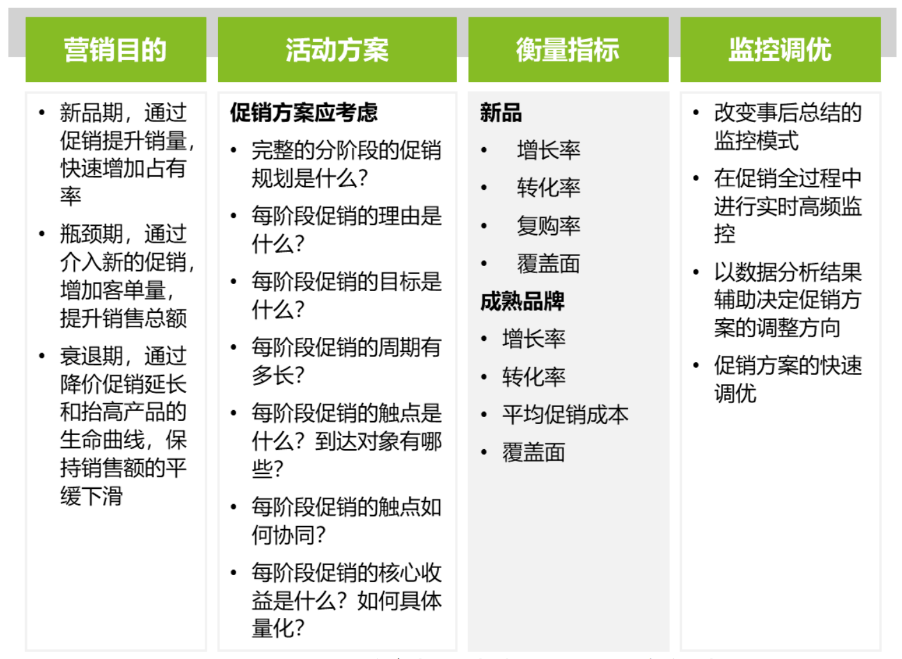
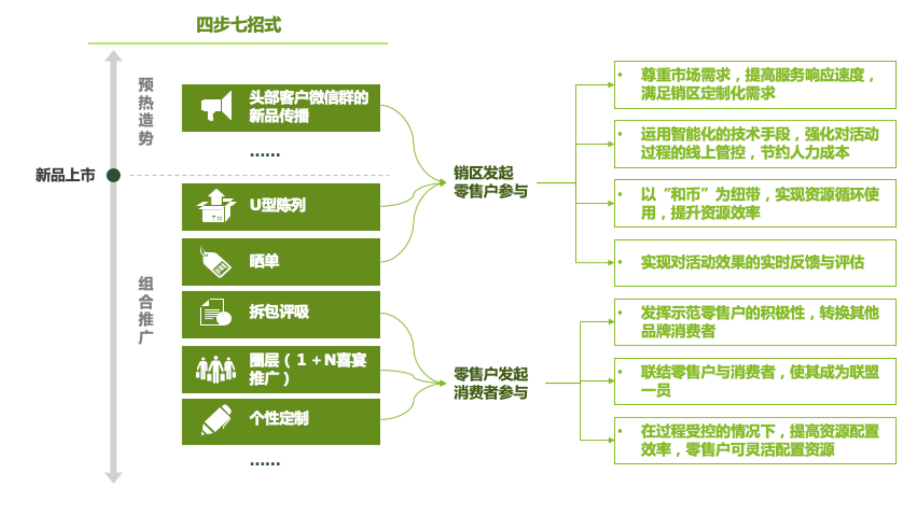
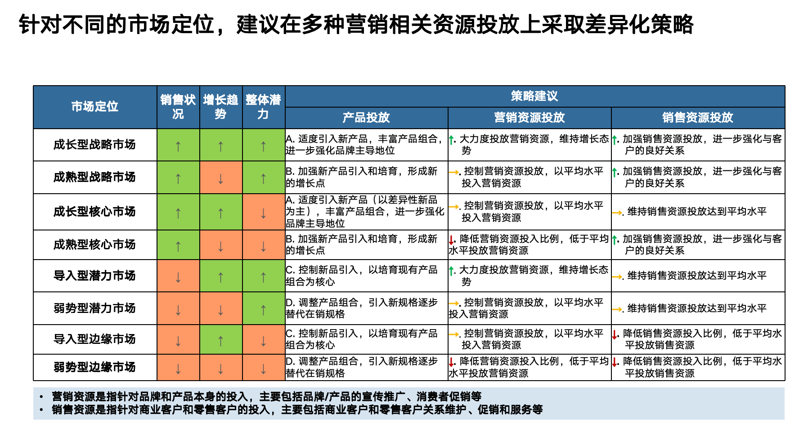
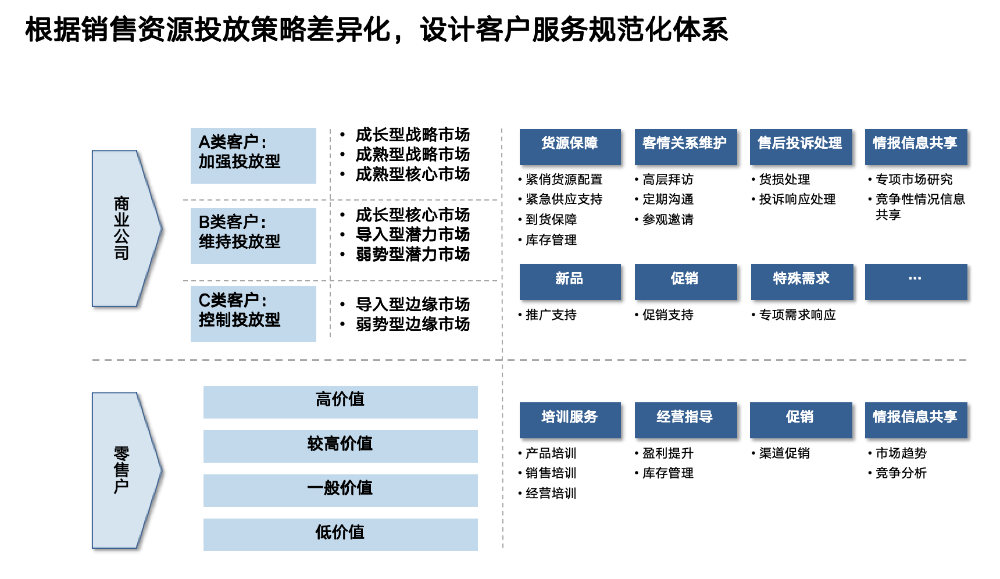

# Digital Market Transformation – Deloitte Consulting

This repository contains selected deliverables from my internship at **Deloitte Consulting**, 
where I participated in a large-scale engagement on **Digital Market Transformation** 
(中烟营销市场化转型). The project aimed to guide China Tobacco in its transition from 
an administratively driven marketing system to a **market-oriented, data-driven, and 
digitally enabled marketing model**.

---

## Project Context

The tobacco industry in China has long operated under a planned and quota-based marketing 
system. By 2014, total cigarette sales had peaked, and the sector began to experience both 
slowing growth and intensifying competition. Traditional approaches — relying on administrative 
allocation, rigid promotional mechanisms, and fragmented campaign execution — were no longer 
sufficient. The company needed to adopt a **Digital Marketing 3.0** approach, combining data 
analytics, scenario-based campaigns, and IT integration to achieve sustainable competitiveness.  

**Client**: China Tobacco (中烟)  
**Engagement**: Digital Market Transformation (Marketing 3.0 Program)  
**Timeline**: 2019–2020 (internship project)  

---

## Objectives
- Diagnose current marketing pain points (Low participation in scan-code promotions, declining activity in WeChat groups, and rigid resource allocation).  
- Design **standards and governance frameworks** for marketization.  
- Propose **IT & digital architecture** (ERP, data governance, CRM integration).  
- Conduct **competitive launch reviews** and build an **activity library** for precision marketing.  

---

## Repository Structure and Topics

The documents and files in this repository represent different dimensions of the transformation effort.  
Each corresponds to a topic Deloitte developed with the client, supported by my work during the internship.  

### 1. Market Diagnostics and Research  
- [营销场景建设项目现状写实及需求调研.pdf](./营销场景建设项目现状写实及需求调研.pdf)  
- [数字化管理.docx](./数字化管理.docx) 

These reports capture the baseline challenges: low engagement in scan-code promotions, declining 
activity in WeChat groups, rigid allocation of promotional resources such as 和币 (internal loyalty point / virtual currency), and limited 
integration of digital platforms. They also reflect the broader industry context, where sales were 
falling and the company sought new levers for growth.  

---

### 2. Standards and Governance Frameworks  
- [营销场景建设项目业务管理规范标准 v0.2.pdf](./营销场景建设项目业务管理规范标准v0.2.pdf)  
- [活动定制与营销研发场景落地思路.pptx](./活动定制与营销研发场景落地思路.pptx)  
- [OKR (folder)](./OKR) 

This strand of work produced a comprehensive **Marketing 3.0 standard**, outlining how new product 
launches should be sequenced, how campaigns should be designed, and how retailer and consumer 
incentives should be structured. The **activity customization framework** introduced the concept of 
an **activity library**, classifying campaigns by purpose, target group, and delivery channel, while 
the **OKR materials** defined a governance mechanism that linked strategy to measurable outcomes.  

This figure illustrates how marketing objectives are translated into activity design, 
measured through clear KPIs, and continuously optimized through monitoring and adjustment. 
It connects product lifecycle stages (new product, bottleneck, mature phase) with 
customized promotional strategies and data-driven evaluation.

The “Four-Step, Seven-Tactic” framework was developed to guide structured marketing 
research and development activities. It breaks down campaign design into four 
progressive steps, each supported by a set of seven tactical approaches such as 
social sharing (晒单集赞), U-shaped shelf displays (U型陈列), first-draw promotions 
(首抽评吸), guided consumption through Orange-Map tools (橙杏导购地图), and 
event-based marketing like wedding or banquet promotions (婚宴推广). The purpose of 
this design is to standardize campaign creation, ensure replicability across different 
regions, and link marketing creativity with measurable business outcomes.

---

### 3. Digital Architecture and IT Enablement  
- Deloitte bid proposals and IT blueprint files (not included in this repo for confidentiality)  

Alongside business standards, Deloitte developed proposals for enterprise-wide **IT architecture**, 
including ERP integration, data governance, cybersecurity, and CRM/MIG platform linkages. My role 
was to align these technical blueprints with marketing use cases, ensuring that technology supported 
closed-loop campaign execution, resource allocation, and performance evaluation.  

---

### 4. Campaign Evidence and Case Reviews  
- [已开展活动汇总 201910.zip](./已开展活动汇总201910.zip)  
- [深度复盘 (黄鹤楼).twbx](./深度复盘(黄鹤楼).twbx)  
- [黄鹤楼硬平安图表.twb](./黄鹤楼硬平安图表.twb) 

Market practice and evidence were essential to making the transformation credible. I organized campaign 
activity data across provinces, built summaries of retail and consumer events, and analyzed campaign 
effectiveness using Excel and Tableau. I also supported **competitive launch reviews**: for example, 
examining how *Chunghwa Dual-Medium* in Zhejiang expanded step by step, and how *Huanghelou Peace* 
in Henan followed a pattern of control, growth, and contraction. These cases highlighted the importance 
of pacing, segmentation, and targeted resource allocation.  

The Campaign Library provides a structured way to design and standardize marketing activities. 
It organizes campaigns by target group (companies, retailers, consumers), objectives (promotion, 
engagement, incentives), lifecycle stage (pre- and post-launch), and resource type (online/offline 
events, coupons, HeBi points, physical goods). Templates define activity objectives, audience, 
format, resources, and duration, making campaigns measurable, repeatable, and scalable across regions.  

This framework outlines how marketing and sales resources should be allocated across 
different market types, depending on sales performance, growth trends, and overall potential. Markets are segmented into categories such as *growth strategic markets, mature strategic markets, 
core markets, potential markets, and marginal markets*. For each, the model specifies 
product investment focus, marketing resource allocation, and sales resource deployment.  

The following framework shows how client service standards can be designed by aligning them with 
resource allocation strategies. Commercial companies and retailers are segmented into 
different categories (A, B, C types or high/low value), and each group receives tailored 
support across areas such as product supply, relationship management, complaints handling, 
and information sharing. 

On the retailer side, clients are categorized by value tiers (high, medium, low). Services 
include product and sales training, operational guidance (profitability improvement, 
inventory management), promotional assistance, and competitive intelligence. 

---

## My Contribution

Throughout the engagement, my work spanned diagnostics, standard setting, IT alignment, and market evidence.  

I helped **research and document baseline issues**, contributed to **drafting process standards and OKR frameworks**, 
prepared **case analyses and campaign reviews**, and supported Deloitte’s **formal bid documents** with evidence 
and draft sections. This cross-functional involvement gave me exposure to the full consulting lifecycle: 
from problem definition, through design and governance, to technology enablement and market validation.  

---

## Skills and Tools Applied

The project deepened my experience in **consulting methodology, market analysis, and digital transformation**.  

I applied **data analysis skills** (Excel, Tableau), practiced **business documentation and standard drafting**, 
and learned how to connect **strategic frameworks with IT architecture**. I also gained experience with 
**OKR-based governance** and the creation of reusable **activity libraries** for campaign design.  

---

## Reflection

This internship taught me how consulting engagements translate strategic ambition into operational reality.

The materials here document a real-world effort to shift an entire industry’s marketing approach toward the 
digital era. For me, they represent not just work products, but an experience of how Deloitte Consulting 
guides transformation: through diagnosis, design, technology, and evidence.  
